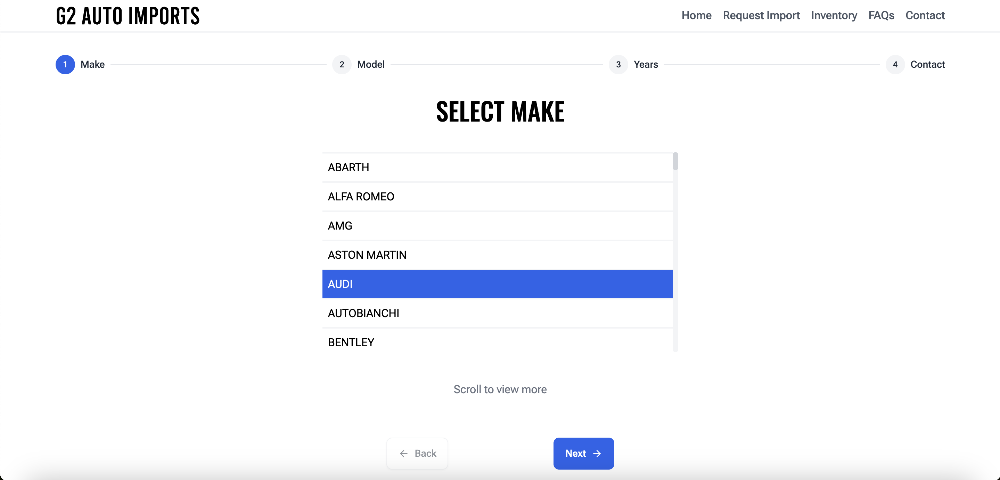
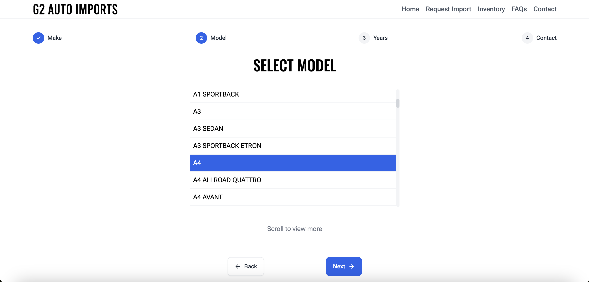
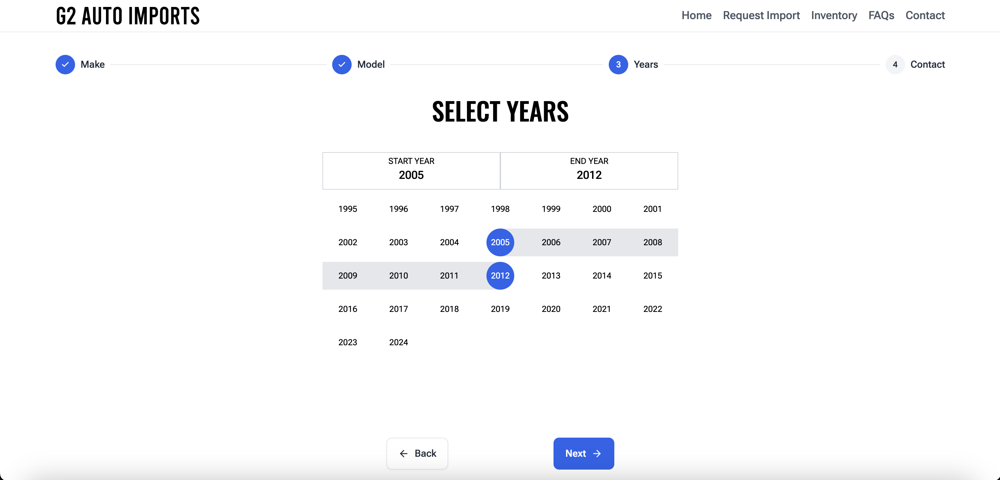
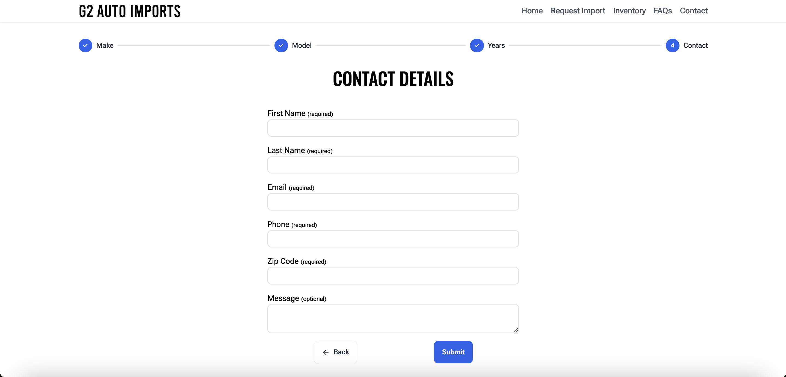

Here’s a draft for your `README.md`:

---

# G2 Auto Imports

G2 Auto Imports is a company specializing in importing Japanese Domestic Market (JDM) cars. This website allows users to either inquire about vehicles currently in inventory or request a specific car to be imported.

## Table of Contents

- [Description](#description)
- [Tech Stack](#tech-stack)
- [Features](#features)
- [Additional Info](#additional-info)

## Description

The G2 Auto Imports website enables users to explore two main services:

1. Browse and inquire about JDM cars that are already in the company’s inventory.
2. Use the multi-step **Request Import** form to request a specific JDM car to be imported based on user-selected preferences like make, model, and production years.

## Tech Stack

- **Next.js** – for server-side rendering and routing
- **React.js** – to build interactive UIs
- **TypeScript** – to provide static typing
- **Tailwind CSS** – for styling the components
- **Prisma** – to interact with the database
- **Better SQLite3** – as the database
- **React-Hook-Form** – for form management
- **Zod** – for form validation
- **EmailJS** – for handling email notifications

## Features

### 1. Multi-step Request Import Form

This feature allows users to easily navigate through several steps to request a specific JDM car import. The process ensures a smooth and guided experience by breaking down the request into manageable steps.

- **Step 1: Select Make**  
  
  Users can select the make of the car from a list fetched dynamically using Prisma.

- **Step 2: Select Model**  
  
  Based on the selected car make, the available models are fetched and presented to the user.

- **Step 3: Select Years**  
  
  Based on the car make and model selected in the previous steps, the available production years for that specific model are fetched and presented to the user. Users can then select a range of years in which they want the car to have been produced. The user interface for this step was inspired by the start date/end date selectors found on airline booking websites.

- **Step 4: Contact Details**  
  
  Users provide their contact information, which includes validation both on the client and server side. Upon submission, both the business and the user receive confirmation emails powered by EmailJS.

- **Form Validation**  
  Validation is handled using **React-Hook-Form** and **Zod** to ensure accuracy and proper data submission.

- **Form State Management**  
  React Context and session storage are employed to persist form selections even when navigating between pages.

### 2. Fully Responsive Design

The website is designed to be fully responsive, offering an optimal experience across mobile and desktop devices.

### 3. Cross-browser Compatibility

The website functions properly across different browsers, ensuring accessibility for all users.

### 4. High Performance

The site achieves **Google Lighthouse** scores of 97+ for Performance, Accessibility, Best Practices, and SEO on both mobile and desktop platforms.

## Additional Info

- Visit the website at [G2 Auto Imports](https://g2-auto-imports.vercel.app/).
- The website has been designed with a focus on usability and smooth user experience, ensuring a frustration-free process for users requesting JDM car imports.

---

Feel free to edit or add any further details if needed!
